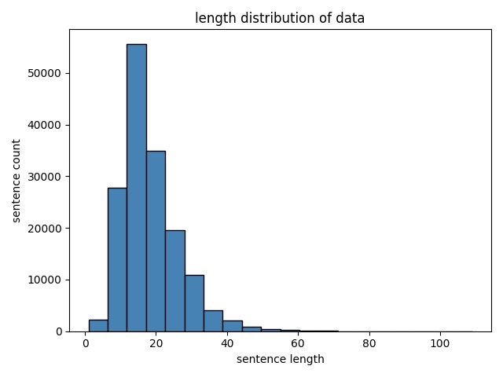
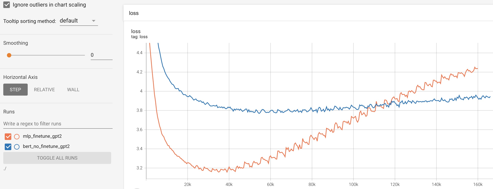
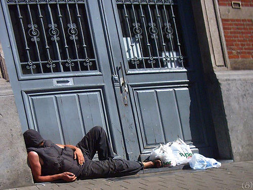
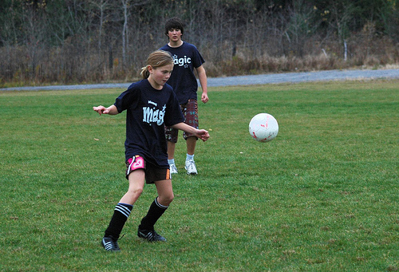

# 基于CLIP与GPT2的中文Image Caption模型

## 项目简介
Image Caption任务，也就是我们常说的看图说话，即给定一张图片，生成图片的文本描述。该任务的难点在于，图像与文字之间存在巨大的鸿沟，
最直观的做法是使用图像编码器对输入的图像进行编码，然后将图像编码输入到文本生层器中，生成caption。
但该做法一般都需要对图像编码器与文本生成器一起训练，训练参数量大，训练时间久。

无论在CV还是NLP方面，我们可以获取到很多模型的预训练权重，图像编码器和文本生成器亦是如此。
我们是否可以直接使用预训练好的图像编码器与文本生成器来进行image caption任务呢，答案显然是不行。
因为单独训练的图像编码器与文本生成器，它们之间的图像空间和文本空间存在着巨大的鸿沟，语义没有进行对齐。
__这就萌生了一个比较直观的想法：既然图像与文本之间的语义空间存在鸿沟，那在它们中间搭一座桥梁进行沟通不就好了吗？__
而文章[ClipCap: CLIP Prefix for Image Captioning](https://arxiv.org/pdf/2111.09734.pdf) 就是基于这个思想，
该论文提出了一种Mapping Network来充当两种图像与文本之间的桥梁，弥补两者之间的语义鸿沟。

在预训练模型方面，作者使用了CLIP和GPT2，两者分别在图像编码和文本生成方面都有非常优秀的表现。作者在CLIP与GPT2中间设计了两种桥梁（Mapping Network）：MLP与Transformer。
处理流程如下：
- 首先使用CLIP对图片进行编码，得到一个图片向量，记作clip_embed。
- 使用Mapping Network对clip_embed进行语义理解，将图像编码映射到文本空间，得到prefix_embed。
- prefix_embed作为提示信息，输入到GPT2中，进行caption生成。

本项目工作概述：
- 图像编码器与文本生成器分别使用CLIP与中文GPT2，预训练权重获取【[ViT-B/32](https://openaipublic.azureedge.net/clip/models/40d365715913c9da98579312b702a82c18be219cc2a73407c4526f58eba950af/ViT-B-32.pt) 】
【[GPT2模型分享-通用中文模型（12层）](https://github.com/Morizeyao/GPT2-Chinese) 】
- Mapping Network分别使用MLP与Bert进行实现（原文的Transformer本质上也是8层多头注意力的堆叠）。
- 使用[Flickr30k数据集](http://hockenmaier.cs.illinois.edu/DenotationGraph/) ，并且使用[机器翻译得到的中文caption数据](https://github.com/li-xirong/cross-lingual-cap) ，质量可能不如原生数据。
- 验证MLP+GPT2 tuning（固定CLIP的权重，MLP与GPT2一起进行finetune）与BertMapper+GPT2 no_tuning（固定CLIP与GPT2权重，只对BertMapper进行finetune）

### 数据集
图片与caption分别来自：[Flickr30k数据集](http://hockenmaier.cs.illinois.edu/DenotationGraph/) 与 [机器翻译得到的中文caption数据](https://github.com/li-xirong/cross-lingual-cap)

使用脚本，对caption进行预处理：
```
python process_caption.py
```

caption被统一处理成以下格式，其中第一列为image_id，第二列为caption，并且每张图有多个caption：
```
1000092795	两个年轻小伙子的头发浓密的看着他们的手在院子里闲逛
1000092795	两只年轻的白色的男性在附近的许多灌木丛
1000092795	绿色衬衫的男人站在一个院子里
1000092795	一个穿蓝色衬衫的人站在花园里
1000092795	朋友们一起享受时光
10002456	几名在硬帽的男人是一个巨大的滑轮系统
10002456	工人从上面的一块设备上往下看
10002456	一个戴着头盔的机器的男人
10002456	四个男人在一个高大的结构上
10002456	三个男人在一个大的钻机
```

caption的长度分布如下图：




__注意：由于caption是使用机器翻译的，所以数据集中，会存在翻译结果不佳的问题。后续会尝试使用更高质量的数据集进行训练。__

例子如下：
```
1003428081	至少有四个房间的窗帘玩乐器演奏单簧管等乐器
1003428081	四名妇女在一个客厅其中三个是清楚地演奏一种乐器
1003428081	一群老年妇女发挥单簧管一起为他们读出乐谱
100444898	一个大的结构已经坏了正在铺设一个巷道
1007205537	看门人推小车在管理员工具
10082348	在一个咖啡杯小便一个人站
100845130	五人走在五彩的天空背景
```


## 项目结构
- datasets：存放数据
- models:存放自己实现的BERT模型代码
- output:输出目录
- pretrain_models：预训练模型存放位置
- scripts：脚本存放位置
- dataset.py
- predict.py:根据图片生成caption
- process_caption.py:将flickr中文caption整理成统一格式
- process_clickr.py:对图片进行编码，获得image-caption训练数据
- statistics.py:对flickr数据集的caption长度分布进行统计
- train.py:训练脚本


## 使用方法
### Quick Start
安装依赖包：
```
pip install -r requirements.txt
```
数据预处理（主要是对图像进行编码，得到train.pkl）：
```
python process_flickr.py
```

训练MLP+GPT2 tuning：
```
bash scripts/train_finetune_gpt2.sh
```
训练BertMapper+GPT2 no_tuning：
```
bash scripts/train_no_finetune_gpt2.sh
```
使用MLP+GPT2 tuning进行生成：
```
bash scripts/predict_finetune_gpt2.sh
```
使用BertMapper+GPT2 no_tuning进行生成：
```
bash scripts/predict_no_finetune_gpt2.sh
```


## 实验说明

### 实验细节
- 图像编码器与文本生成器分别使用CLIP与中文GPT2，预训练权重分别使用的是【[ViT-B/32](https://openaipublic.azureedge.net/clip/models/40d365715913c9da98579312b702a82c18be219cc2a73407c4526f58eba950af/ViT-B-32.pt) 】
【[GPT2模型分享-通用中文模型](https://github.com/Morizeyao/GPT2-Chinese) 】。
- 在训练的时候，CLIP模型的权重均被冻结。在MLP+GPT2 tuning中MLP与GPT2的权重均进行finetune。在BertMapper+GPT2 no_tuning中，只对BertMapper进行finetune。
- 训练时的batch size为40，epoch为40，学习率为2e-5，prefix_len为10，constant_len为10，clip_size为512，warmup_steps为5000。


### 训练过程分析
训练过程中，模型在验证集上的loss的变化，可以在output文件夹下查看，运行如下脚本：
```
tensorboard --logdir ./output 
```
训练过程中，模型在验证集上的变化曲线如下图：



简单的总结：
- 仅从验证集loss的角度，可以看到，相比于BertMapper+GPT2 no_tuning，MLP+GPT2 tuning的收敛速度更快，并且能够达到更好的效果。
这也比较符合常理，因为在MLP+GPT2 tuning中，MLP与GPT2模型的参数是一起训练的，使得文本空间往图像空间靠拢。而在BertMapper+GPT2 no_tuning中，
只有BertMapper参数在进行训练，而GPT2是固定的，因此BertMapper的训练难度更高。
- 训练30-40k步的时候，模型趋于收敛，继续训练模型loss不降反升。


## 生成效果
为了验证模型的caption生成效果，我们分别在dev和test这两个小批量图片上进行caption生成。对于每张图片，使用topp采样（核采样）生成10个候选的caption，
其中p设为0.8。dev与test数据说明如下：

|  数据 | 数据来源| 数据路径 |生成路径 |
| ----  | ----  | ----  |  ----  | 
|dev|  训练时候的验证数据  | datasets/dev | output/dev|
|test| 从[flickr blog](https://blog.flickr.net/en) 网站首页随机下载的图片  |  datasets/test | output/test|


###  Dev生成效果
下表展示了模型在Dev图片上的生成效果。其中每张图对应两个生成caption，其中第一个为MLP+GPT2 tuning生成的，第二个为BertMapper+GPT2 no_tuning生成的

|   | |  | 
| ----  | ----  | ----  |  
|    |  ||
| 1、男人和女人站在卖农产品的摊位前<br/> 2、一群人站在街上卖货|  1、一群人在桥上的一个码头上<br/> 2、三个人正在在一条绳索中转动| 1、一个无家可归的人睡在街上<br/>2、在大街上睡觉的人躺在一个侧门上|
|    |  ||
| 1、一个穿红色衬衣和牛仔裤的人在木制的建筑物外面走<br/> 2、一个穿红色衬衫的男人在一个空旷的街道|  1、有几个人坐在一个露天的桌子旁 <br/> 2、一群人在一个烧烤的台子上烤串| 1、一个女孩和男孩在足球场上踢足球 <br/>2、两个孩子在踢足球|


下面为多结果展示，可以明显看到MLP+GPT2 tuning的生成效果好于BertMapper+GPT2 no_tuning。更多生成caption可查看目录output/dev。


MLP+GPT2 tuning生成的10个case如下：
```
一个穿红色衬衣和牛仔裤的人在木制的建筑物外面走
一个穿着牛仔裤和恤衫的年轻人站在一个棕色的混凝土结构外
一个穿红色衬衣的人正在走下楼梯
一个穿着牛仔裤和一件红色恤衫的人在楼梯上走着
一个穿着蓝色牛仔裤和红色恤衫的人在外面
一个人走在一个高高的篱笆上
一个人站在一个残桩上一个水桶
一个穿着牛仔裤和恤衫的年轻人站在一个木门旁边一个手推车
一个男人正走在一个停车场
一个人带着一顶红色的帽子和一条红色的围巾看起来他正走在一个小木屋里
```
BertMapper+GPT2 no_tuning生成的10个case如下：
```

一个穿着红色衬衫的人在一个自行车棚
一个穿红色衬衫的男人在一个空旷的街道
一个年轻的男人走在一个小的院子
一个穿着灰色裤子和灰色衬衫的人是在一个农庄里走的
一个穿红色衬衫的年轻人走在红色衬衫外面的围栏外
一个穿着灰色和黑色夹克的男人走在一个地方
一个人在房间里打着什么
一个人踩在一个红色的高跟鞋的门槛上
一个年轻人从楼上的建筑物开始跑步穿着拖鞋在院子里
一个穿着衬衫和蓝色牛仔裤的男人正在操作他的人
```

### Test生成效果


### 模型与数据权重分享
|  模型 | 链接| 
| ----  | ----  | 
|BertMapper+GPT2 no_tuning|    |  
|MLP+GPT2 tuning|    |  
|VIT-B-32||

|  模型 | 链接| 
| ----  | ----  | 
|flickr30k图片数据|    |  
|flickr30k中文caption|    |  

## 提升方向
- flickr30中文caption数据是由机器翻译获得的，质量上存在缺陷，后续考虑使用更加高质量的数据训练一版模型。
- 原文使用的生成模型为GPT2-Large，包含36层Attention。本项目使用的GPT2模型包含12层Attention，后续可以考虑使用更好的生成模型，以提高生成效果。


## REFERENCE
- https://github.com/openai/CLIP
- https://github.com/rmokady/CLIP_prefix_caption
- https://arxiv.org/abs/2111.09734


